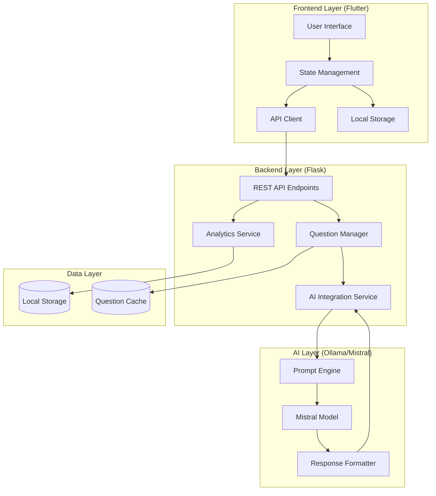

# System Architecture Documentation - Quizlly

## Overview
The Quizlly system follows a modern, layered architecture pattern combining Flutter for cross-platform frontend, Flask for backend services, and Ollama/Mistral AI for question generation.

## Architecture Diagram


## Component Details

### 1. Frontend Layer (Flutter)
- **User Interface**
  - Cross-platform UI components
  - Responsive design for multiple screen sizes
  - Material Design implementation
  - Accessibility features

- **State Management**
  - Quiz session state
  - User progress tracking
  - Response caching
  - Error handling

- **API Client**
  - RESTful API communication
  - Request/response handling
  - Error handling and retry logic
  - Data serialization/deserialization

- **Local Storage**
  - Offline data persistence
  - User preferences
  - Quiz history
  - Performance metrics

### 2. Backend Layer (Flask)
- **REST API Endpoints**
  - Question generation
  - Answer validation
  - Progress tracking
  - Analytics collection

- **Question Manager**
  - Question format validation
  - Difficulty adjustment
  - Question caching
  - Response optimization

- **AI Integration Service**
  - AI model communication
  - Prompt management
  - Response processing
  - Error handling

- **Analytics Service**
  - Performance tracking
  - Usage statistics
  - Error logging
  - Metrics collection

### 3. AI Layer (Ollama/Mistral)
- **Mistral Model**
  - Question generation
  - Answer validation
  - Explanation generation
  - Context understanding

- **Prompt Engine**
  - Template management
  - Context injection
  - Parameter optimization
  - Quality control

- **Response Formatter**
  - JSON formatting
  - Validation
  - Error detection
  - Quality assurance

### 4. Data Layer
- **Local Storage**
  - User data
  - Quiz history
  - Performance metrics
  - System settings

- **Question Cache**
  - Frequently used questions
  - Generated content
  - Temporary storage
  - Performance optimization

## Communication Flows

### Frontend to Backend
1. **Quiz Initialization**
   ```json
   POST /api/quiz/init
   {
     "topic": "string",
     "difficulty": "string",
     "userPreferences": {}
   }
   ```

2. **Question Request**
   ```json
   GET /api/questions/{id}
   Response: {
     "question": "string",
     "options": ["string"],
     "difficulty": "string"
   }
   ```

3. **Answer Submission**
   ```json
   POST /api/quiz/answer
   {
     "questionId": "string",
     "answer": "string",
     "timeSpent": "number"
   }
   ```

### Backend to AI Layer
1. **Question Generation Request**
   ```json
   {
     "topic": "string",
     "difficulty": "string",
     "previousQuestions": ["string"],
     "constraints": {}
   }
   ```

2. **AI Response Format**
   ```json
   {
     "question": "string",
     "options": ["string"],
     "correctAnswer": "string",
     "explanation": "string",
     "metadata": {}
   }
   ```

## Security Measures

1. **Frontend Security**
   - Input validation
   - XSS prevention
   - Secure local storage
   - API key protection

2. **Backend Security**
   - Authentication
   - Rate limiting
   - Input sanitization
   - CORS configuration

3. **AI Layer Security**
   - Prompt injection prevention
   - Response validation
   - Content filtering
   - Resource limits

4. **Data Security**
   - Encryption at rest
   - Secure transmission
   - Access control
   - Data privacy

## Performance Considerations

1. **Frontend Optimization**
   - Lazy loading
   - State caching
   - Image optimization
   - Bundle size optimization

2. **Backend Optimization**
   - Response caching
   - Connection pooling
   - Load balancing
   - Resource management

3. **AI Performance**
   - Prompt optimization
   - Response caching
   - Batch processing
   - Resource allocation

4. **Data Layer Performance**
   - Index optimization
   - Query optimization
   - Cache management
   - Storage efficiency

## Error Handling

1. **Frontend Error Handling**
   - Network errors
   - API failures
   - State inconsistencies
   - UI error messages

2. **Backend Error Handling**
   - Input validation errors
   - Processing errors
   - AI service failures
   - Database errors

3. **AI Error Handling**
   - Generation failures
   - Invalid responses
   - Timeout handling
   - Fallback mechanisms

## Monitoring and Logging

1. **System Metrics**
   - Response times
   - Error rates
   - Resource usage
   - User engagement

2. **Application Logs**
   - Error logs
   - Access logs
   - Performance logs
   - Security logs

3. **Analytics**
   - User behavior
   - Question statistics
   - Performance metrics
   - Usage patterns 