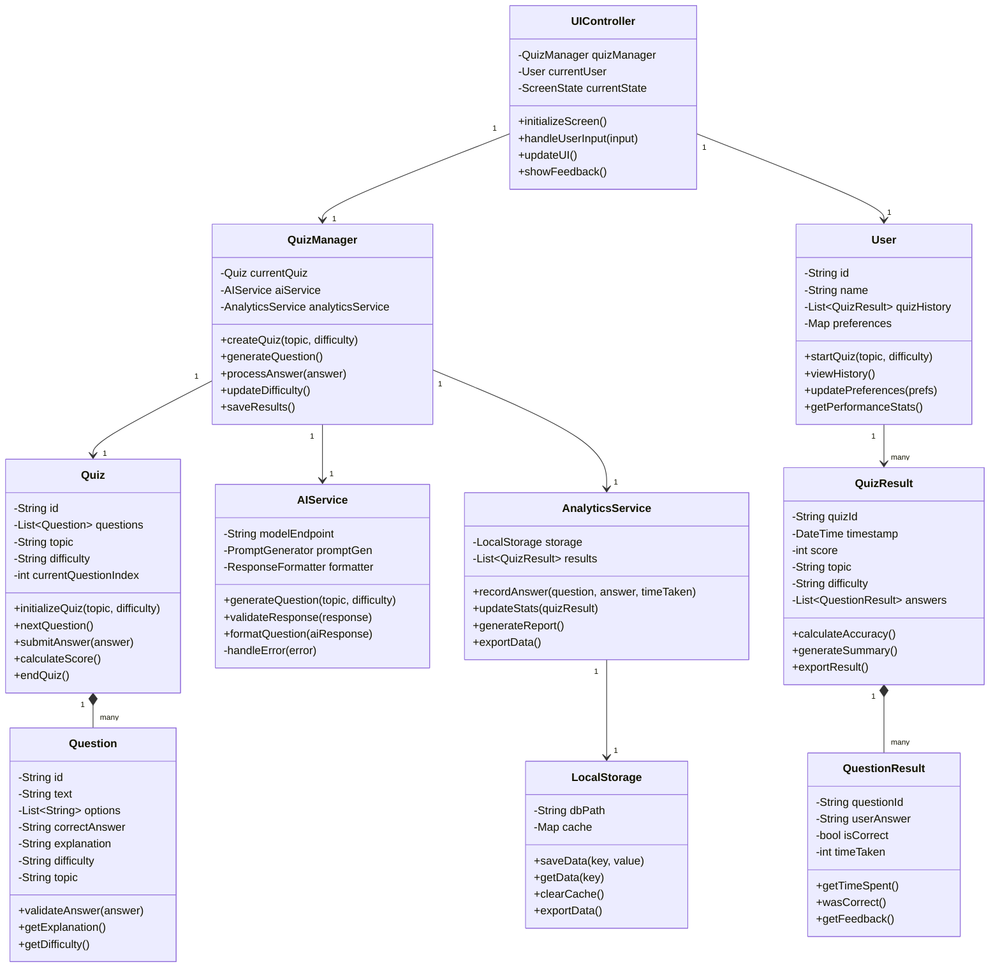

# Class Diagram Documentation - Quizlly

## Overview
The class diagram represents the object-oriented structure of the Quizlly application, showing the relationships between different classes in both frontend and backend components.

## Class Diagram


## Class Descriptions

### Core Classes

#### 1. Quiz
- **Purpose**: Represents a quiz session
- **Key Attributes**:
  - `id`: Unique identifier
  - `questions`: Collection of questions
  - `topic`: Quiz subject area
  - `difficulty`: Current difficulty level
- **Key Methods**:
  - `initializeQuiz()`: Sets up new quiz
  - `nextQuestion()`: Advances to next question
  - `submitAnswer()`: Processes user's answer
  - `calculateScore()`: Computes final score

#### 2. Question
- **Purpose**: Represents individual quiz questions
- **Key Attributes**:
  - `text`: Question content
  - `options`: Multiple choice options
  - `correctAnswer`: Correct option
  - `explanation`: Answer explanation
- **Key Methods**:
  - `validateAnswer()`: Checks user's answer
  - `getExplanation()`: Returns explanation
  - `getDifficulty()`: Returns difficulty level

### Management Classes

#### 3. QuizManager
- **Purpose**: Manages quiz flow and state
- **Key Attributes**:
  - `currentQuiz`: Active quiz instance
  - `aiService`: AI service reference
  - `analyticsService`: Analytics service reference
- **Key Methods**:
  - `createQuiz()`: Initializes new quiz
  - `generateQuestion()`: Gets next question
  - `processAnswer()`: Handles user response
  - `updateDifficulty()`: Adjusts difficulty

#### 4. AIService
- **Purpose**: Handles AI integration
- **Key Attributes**:
  - `modelEndpoint`: AI model URL
  - `promptGen`: Prompt generator
  - `formatter`: Response formatter
- **Key Methods**:
  - `generateQuestion()`: Creates questions
  - `validateResponse()`: Verifies AI output
  - `formatQuestion()`: Structures response

### User Management

#### 5. User
- **Purpose**: Manages user data and preferences
- **Key Attributes**:
  - `id`: User identifier
  - `quizHistory`: Past quiz results
  - `preferences`: User settings
- **Key Methods**:
  - `startQuiz()`: Begins new quiz
  - `viewHistory()`: Shows past results
  - `updatePreferences()`: Changes settings

#### 6. QuizResult
- **Purpose**: Stores quiz completion data
- **Key Attributes**:
  - `quizId`: Quiz identifier
  - `score`: Final score
  - `answers`: Individual answers
- **Key Methods**:
  - `calculateAccuracy()`: Computes score
  - `generateSummary()`: Creates report
  - `exportResult()`: Exports data

### UI and Storage

#### 7. UIController
- **Purpose**: Manages user interface
- **Key Attributes**:
  - `quizManager`: Quiz manager reference
  - `currentState`: UI state
- **Key Methods**:
  - `initializeScreen()`: Sets up UI
  - `handleUserInput()`: Processes input
  - `updateUI()`: Refreshes display

#### 8. LocalStorage
- **Purpose**: Handles data persistence
- **Key Attributes**:
  - `dbPath`: Storage location
  - `cache`: Memory cache
- **Key Methods**:
  - `saveData()`: Stores data
  - `getData()`: Retrieves data
  - `clearCache()`: Cleans cache

## Relationships

### Composition Relationships
1. Quiz -- Question (1:many)
   - Quiz contains multiple questions
   - Questions cannot exist without a Quiz

2. QuizResult -- QuestionResult (1:many)
   - QuizResult contains multiple QuestionResults
   - QuestionResults are part of a QuizResult

### Association Relationships
1. QuizManager -- AIService (1:1)
   - QuizManager uses AIService for question generation
   - Loose coupling for service independence

2. QuizManager -- AnalyticsService (1:1)
   - QuizManager sends data to AnalyticsService
   - AnalyticsService processes quiz statistics

### Dependency Relationships
1. UIController -- QuizManager
   - UIController depends on QuizManager for quiz operations
   - Maintains separation of concerns

2. AnalyticsService -- LocalStorage
   - AnalyticsService uses LocalStorage for data persistence
   - Allows for storage implementation changes

## Design Patterns Used

### 1. Singleton Pattern
- Applied to:
  - QuizManager
  - AIService
  - AnalyticsService
- Ensures single instance management

### 2. Observer Pattern
- Applied to:
  - UIController watching QuizManager
  - AnalyticsService watching quiz events
- Maintains loose coupling

### 3. Factory Pattern
- Applied to:
  - Question generation
  - Quiz creation
- Encapsulates object creation

### 4. Strategy Pattern
- Applied to:
  - Difficulty adjustment
  - Question generation
- Allows for algorithm variation

## Error Handling

### 1. Exception Classes
- `QuizException`
- `AIServiceException`
- `StorageException`
- `ValidationException`

### 2. Error Recovery
- Graceful degradation
- Fallback mechanisms
- User feedback

## Data Flow

### 1. Quiz Creation
```sequence
User -> UIController: Start Quiz
UIController -> QuizManager: Create Quiz
QuizManager -> AIService: Generate Questions
AIService -> QuizManager: Questions
QuizManager -> Quiz: Initialize
```

### 2. Answer Processing
```sequence
User -> UIController: Submit Answer
UIController -> QuizManager: Process Answer
QuizManager -> Question: Validate
Question -> QuizManager: Result
QuizManager -> AnalyticsService: Record
```

## Future Extensibility

### 1. New Features
- Multiple question types
- Social features
- Offline mode
- Custom topics

### 2. Scalability
- Distributed storage
- Load balancing
- Caching strategies
- Performance optimization 