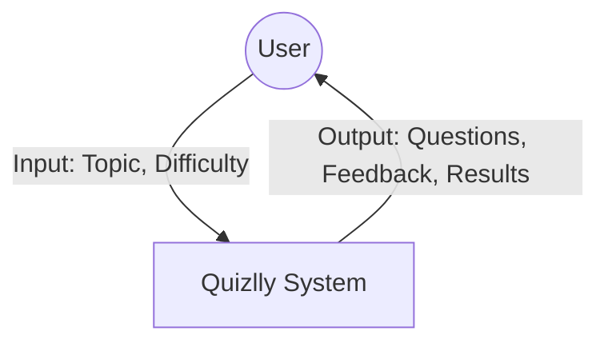
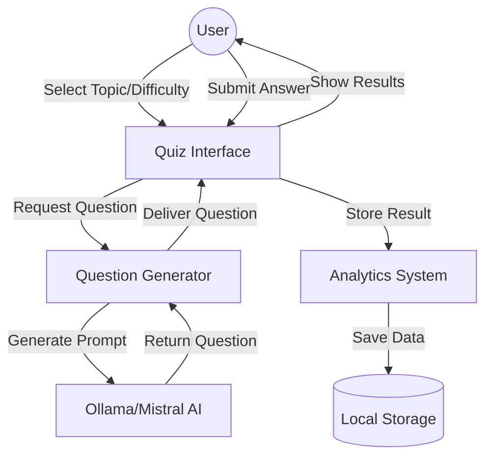
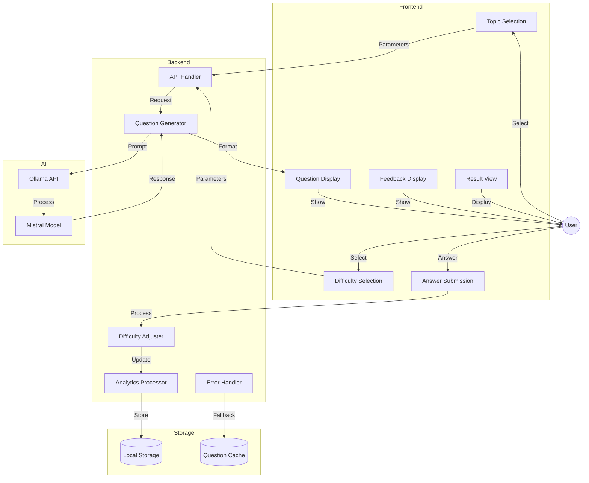

# Data Flow Diagrams (DFD) Documentation - Quizlly

## Level 0 DFD (Context Diagram)


## Level 1 DFD (Main Processes)


## Level 2 DFD (Detailed Processes)


## Data Dictionary

### Data Stores
1. **Local Storage**
   - Quiz results
   - User performance metrics
   - Analytics data
   - Usage statistics

2. **Question Cache**
   - Temporary question storage
   - Fallback questions
   - Recent questions history

### Data Flows
1. **User Input Flows**
   - Topic selection
   - Difficulty selection
   - Answer submission
   - Navigation actions

2. **System Output Flows**
   - Generated questions
   - Feedback messages
   - Performance results
   - Error messages

3. **Internal Flows**
   - AI prompt generation
   - Question formatting
   - Difficulty adjustment
   - Analytics processing

### External Entities
1. **User**
   - Primary actor
   - Interacts with quiz interface
   - Receives feedback and results

2. **Ollama/Mistral AI**
   - Question generation service
   - Processes prompts
   - Returns formatted questions

### Key Processes

1. **Quiz Interface (Frontend)**
   - Topic Selection
   ```
   Input: User choice
   Process: Validate and format selection
   Output: Topic parameter
   ```
   
   - Difficulty Selection
   ```
   Input: User choice (Easy/Medium/Hard)
   Process: Validate and format selection
   Output: Difficulty parameter
   ```

   - Question Display
   ```
   Input: Formatted question object
   Process: Render question and options
   Output: Interactive question view
   ```

2. **Question Generation (Backend)**
   - API Handler
   ```
   Input: Topic and difficulty parameters
   Process: Format request, handle errors
   Output: AI prompt or error response
   ```

   - Question Generator
   ```
   Input: AI model response
   Process: Format and validate question
   Output: Structured question object
   ```

   - Difficulty Adjuster
   ```
   Input: User performance data
   Process: Calculate next difficulty
   Output: Updated difficulty level
   ```

3. **Analytics System**
   - Performance Tracker
   ```
   Input: Quiz results
   Process: Calculate metrics
   Output: Performance statistics
   ```

   - Storage Manager
   ```
   Input: Analytics data
   Process: Format and store data
   Output: Persistent storage
   ```

## Process Specifications

1. **Question Generation Process**
   - Accepts topic and difficulty
   - Generates AI prompt
   - Validates AI response
   - Formats question structure
   - Handles generation errors

2. **Answer Processing**
   - Validates user input
   - Checks correct answer
   - Generates feedback
   - Updates performance metrics
   - Adjusts difficulty

3. **Results Generation**
   - Calculates final score
   - Compiles question history
   - Generates performance summary
   - Prepares detailed feedback

## Data Validations

1. **Input Validation**
   - Topic must be from predefined list
   - Difficulty must be Easy/Medium/Hard
   - Answers must be selected before submission

2. **Question Validation**
   - Must have exactly 4 options
   - Must have one correct answer
   - Must include explanation
   - Must match difficulty level

3. **Performance Validation**
   - Score must be 0-100%
   - Streak count must be non-negative
   - Difficulty adjustments must be valid 