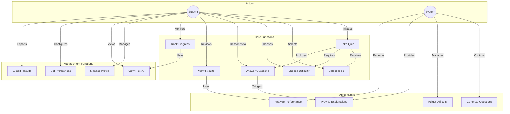

# Use Case Diagram Documentation - Quizlly

## Overview
The use case diagram illustrates the interactions between users and the Quizlly system, showing the main functionalities and user roles.

## Use Case Diagram

## Actor Descriptions

### 1. Student
- **Primary Actor**: Main user of the system
- **Goals**:
  - Take adaptive quizzes
  - Learn from explanations
  - Track learning progress
  - Manage personal settings
- **Interactions**:
  - Initiates quiz sessions
  - Answers questions
  - Reviews results
  - Manages profile

### 2. System
- **Supporting Actor**: AI-powered backend
- **Goals**:
  - Generate relevant questions
  - Adapt difficulty
  - Provide feedback
  - Track analytics
- **Interactions**:
  - Processes user input
  - Generates questions
  - Adjusts difficulty
  - Records progress

## Use Case Descriptions

### Core Functions

#### 1. Take Quiz
- **Description**: Main quiz-taking workflow
- **Primary Actor**: Student
- **Preconditions**:
  - User is logged in
  - Topic selected
  - Difficulty chosen
- **Main Flow**:
  1. User selects topic
  2. User chooses difficulty
  3. System generates questions
  4. User answers questions
  5. System provides feedback
- **Alternative Flows**:
  - User pauses quiz
  - User exits quiz
  - System error recovery
- **Postconditions**:
  - Quiz results saved
  - Progress updated
  - Analytics recorded

#### 2. Select Topic
- **Description**: Choose quiz subject
- **Primary Actor**: Student
- **Preconditions**:
  - User is logged in
- **Main Flow**:
  1. System displays topics
  2. User selects topic
  3. System validates selection
- **Alternative Flows**:
  - Topic unavailable
  - Custom topic request
- **Postconditions**:
  - Topic selected
  - Ready for difficulty selection

#### 3. Choose Difficulty
- **Description**: Set quiz difficulty
- **Primary Actor**: Student
- **Preconditions**:
  - Topic selected
- **Main Flow**:
  1. System shows difficulty levels
  2. User selects level
  3. System confirms selection
- **Alternative Flows**:
  - Adaptive difficulty
  - Previous performance based
- **Postconditions**:
  - Difficulty set
  - Ready for questions

### AI Functions

#### 1. Generate Questions
- **Description**: AI creates questions
- **Primary Actor**: System
- **Preconditions**:
  - Topic and difficulty set
- **Main Flow**:
  1. Process topic/difficulty
  2. Generate AI prompt
  3. Format response
  4. Validate question
- **Alternative Flows**:
  - Use cached questions
  - Error recovery
- **Postconditions**:
  - Questions ready
  - Cache updated

#### 2. Adjust Difficulty
- **Description**: Dynamic difficulty adjustment
- **Primary Actor**: System
- **Preconditions**:
  - User performance data available
- **Main Flow**:
  1. Analyze performance
  2. Calculate new level
  3. Apply adjustment
- **Alternative Flows**:
  - Manual override
  - Reset to default
- **Postconditions**:
  - Difficulty updated
  - User notified

### Management Functions

#### 1. Manage Profile
- **Description**: User profile management
- **Primary Actor**: Student
- **Preconditions**:
  - User authenticated
- **Main Flow**:
  1. View profile
  2. Edit settings
  3. Save changes
- **Alternative Flows**:
  - Reset preferences
  - Delete data
- **Postconditions**:
  - Profile updated
  - Settings saved

#### 2. View History
- **Description**: Access past quizzes
- **Primary Actor**: Student
- **Preconditions**:
  - Quiz history exists
- **Main Flow**:
  1. Request history
  2. Filter results
  3. View details
- **Alternative Flows**:
  - Export data
  - Clear history
- **Postconditions**:
  - History displayed
  - Analytics updated

## Relationships

### 1. Include Relationships
- Take Quiz → Select Topic
- Take Quiz → Choose Difficulty
- Take Quiz → Answer Questions
- View Results → Analyze Performance

### 2. Extend Relationships
- Answer Questions → Provide Explanations
- Track Progress → View History
- Manage Profile → Set Preferences

## System Boundaries

### 1. Frontend Boundary
- User interface components
- Input validation
- Result display
- Profile management

### 2. Backend Boundary
- AI processing
- Data storage
- Analytics
- Security

## Error Scenarios

### 1. User Errors
- Invalid input
- Timeout
- Connection loss
- Session expiry

### 2. System Errors
- AI generation failure
- Database errors
- Performance issues
- Security breaches

## Success Scenarios

### 1. Quiz Completion
1. Topic selection
2. Difficulty setting
3. Question generation
4. Answer submission
5. Result display

### 2. Progress Tracking
1. Quiz completion
2. Performance analysis
3. History update
4. Statistics generation

## Performance Requirements

### 1. Response Time
- Question generation: < 3s
- Answer validation: < 1s
- Results display: < 2s
- History loading: < 3s

### 2. Reliability
- System uptime: 99.9%
- Data persistence: 100%
- Error recovery: < 5s
- Backup frequency: Daily

## Security Requirements

### 1. Authentication
- Secure login
- Session management
- Password protection
- Role-based access

### 2. Data Protection
- Encryption
- Privacy compliance
- Audit logging
- Backup security

## Future Extensions

### 1. New Features
- Group quizzes
- Peer comparison
- Custom topics
- Advanced analytics

### 2. Integrations
- LMS systems
- Social platforms
- Mobile apps
- Cloud services 